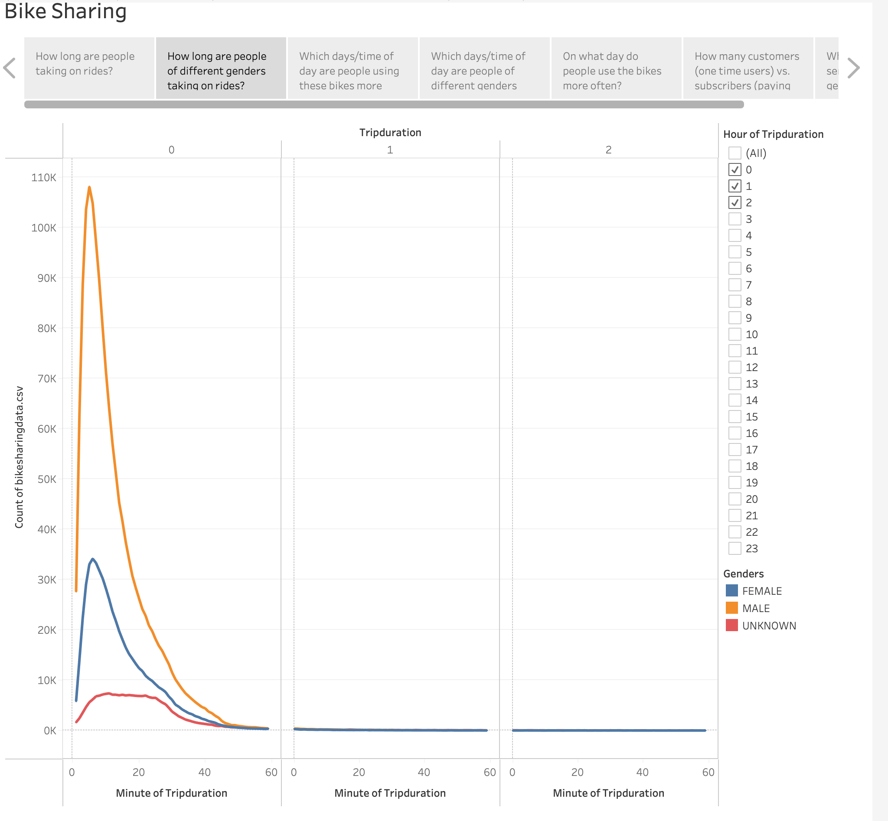
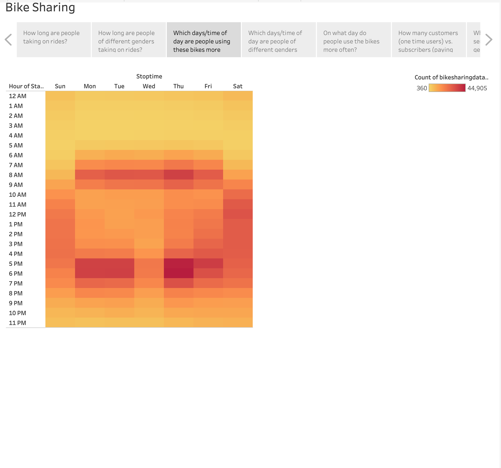
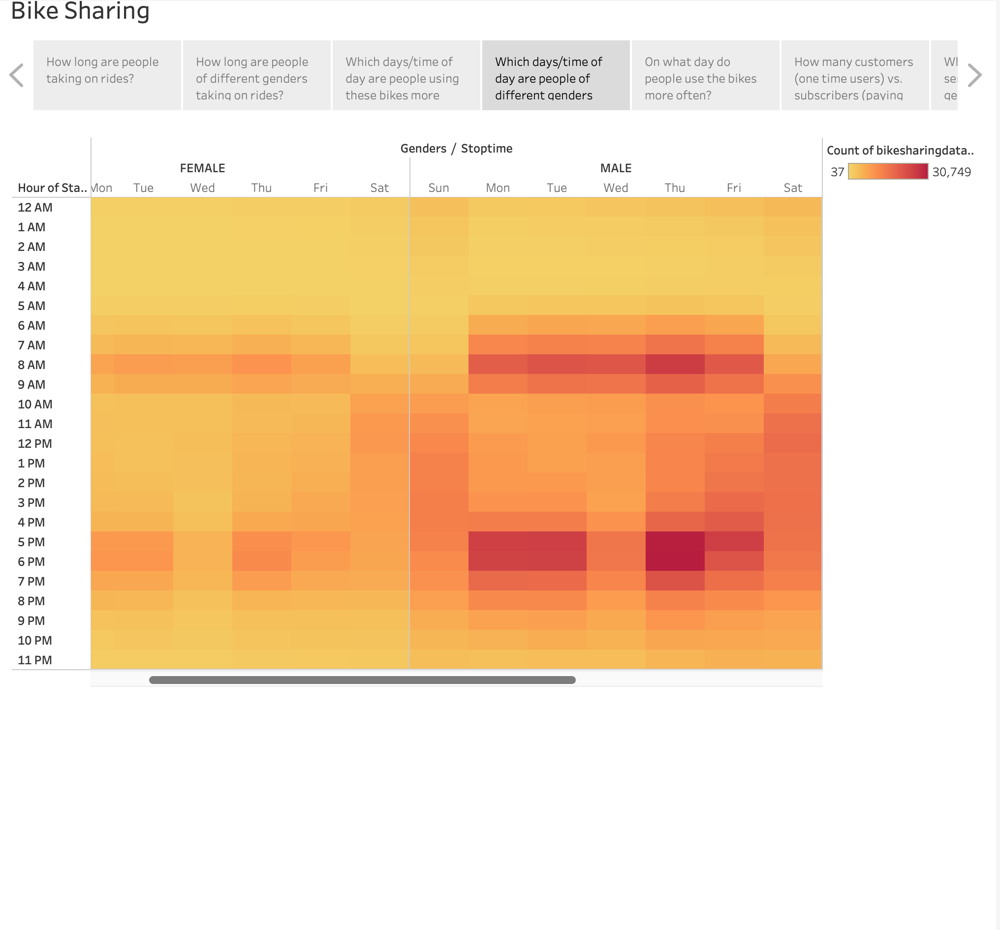
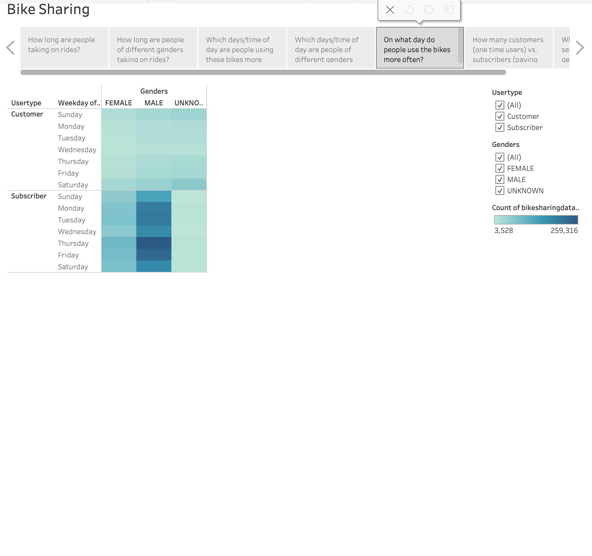
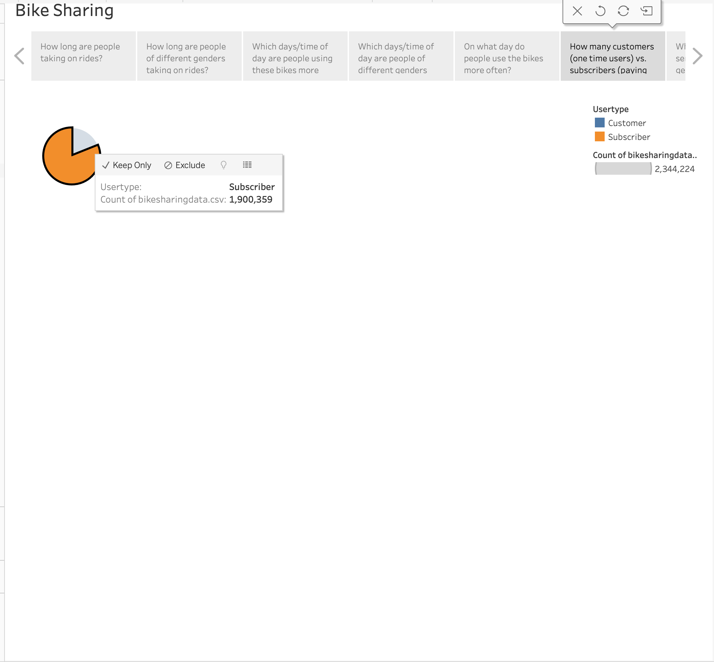
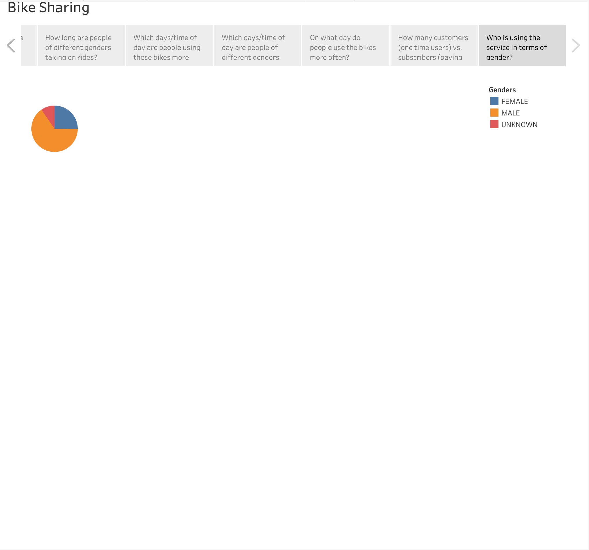

# Bike Sharing

### [Link to Tableau Dashboard](https://public.tableau.com/app/profile/julian.diaz3750/viz/CitiBikeData_16777270024310/Story1?publish=yes)

### Overview of Project

  In this project, we analyzed the Citi Bike data from 2019 and used Tableau to create visualizations that provide insights into the usage patterns of the bike-sharing service. We examined several aspects of the data, including trip duration, user demographics, and the most active days and times for the service.
  
### Results

  Here we will go over 7 visualizations that we gathered from the data.
  
#### Visualizations

Here we have a visualization showing trip duration times. What we can gather is that a huge majority of trips made (145k+) are only under 10 minutes long. This shows us that users are mainly only using Citi Bike for short distance travels as opposed to long distance. This also shows us that there are no trips exceeding 3 hours.

Here is a similar visualization except it is categorized by what gender the user identifies as. The viz shows that no matter the gender, the trips tend to average out at around the same time under 10 minutes and then start to diminish at around 35 - 40 minutes.

Here is a heatmap that shows what days/times people are taking rides on the most. Here we can gather that thursday at 5/6pm is very active day/time for the service, along with monday, and tuesday at the same times as thursday. The service seems to get more traffic overall thursday through saturday/sunday.

Here is a similar heatmap, but there is three and it is categorized by gender. Here we can see that males/females typically use the service at the same times. It appears more red on the males side due to the fact that there are a lot more males that use the service compared to females.

Here is a heatmap that seperates users by gender and whether they are a one-time user or subscriber of the service. This shows us which days the users use the service more and shows us that the majority of users on the service are male subscribers.

Here is a pie chart that shows the ratio of subscribers vs one-times users. It's very clear that this service has a lot of loyal subscribers when compared to the amount of one-time users that it has. There is almost 2 million subscribers and under 500,000 one-time uses.

Here is a pie chart that shows which genders use the service. The numbers come out to ~1.5m male users, ~590k female users, and ~225k unknown gender users.

## Summary 

To summarize the results, we discovered that a majority of users are male, a majority of users are on the subscription plan, and the service is mainly used for short distance travels. The trip duration for all genders tends to average out at under 10 minutes, and the most active days/times for the service are thursday, monday, and tuesday at 5/6pm. Additionally, the heatmap shows that male subscribers are the most frequent users of the service, and there are almost 2 million subscribers compared to under 500,000 one-time users. Overall, these visualizations provide valuable insights into the usage patterns of the Citi Bike service.

Another useful visualization could be a line chart that shows how the user demographics (e.g., gender, age, etc.) have changed over time. This would help track changes in the user base and identify any trends or patterns that may have emerged over time. It could also be useful for identifying any potential biases or gaps in the service's marketing or outreach efforts.

A heatmap or map visualization could be created to show the most popular destinations for different user types (e.g., subscribers vs. one-time users). This could help identify any differences in usage patterns between these user groups and could provide insights into the types of trips that each group tends to take. For example, subscribers may be more likely to use the service for commuting to work or school, while one-time users may be more likely to use the service for leisure activities or sightseeing. This information could be useful for tailoring marketing or outreach efforts to specific user groups and improving the overall user experience.
