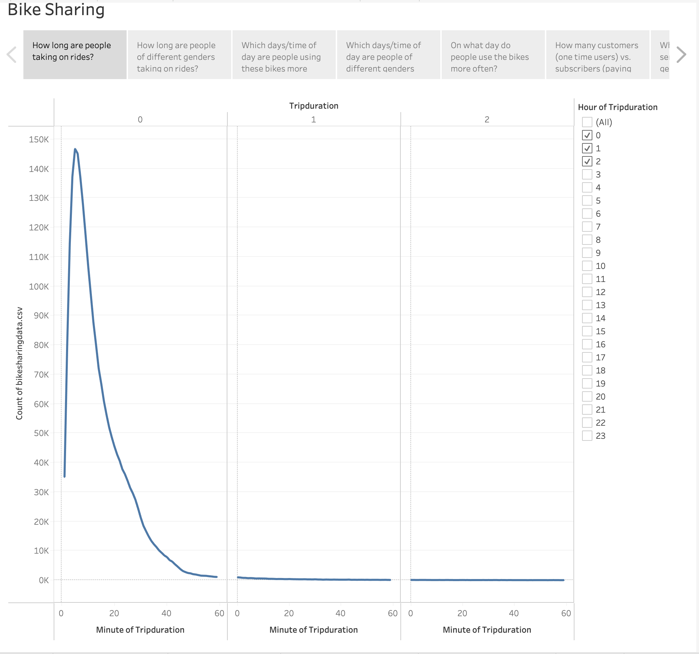

# Bike Sharing

### Overview of Project

  In this project, we took a look at Citi Bikes data from 2019 and used Tableau to visualize different insights we gathered from the data.
  
### Results

  Here we will go over 7 visualizations that we gathered from the data.
  
#### Visualizations

Here we have a visualization showing trip duration times. What we can gather is that a huge majority of trips made (145k+) are only under 10 minutes long. This shows us that users are mainly only using Citi Bike for short distance travels as opposed to long distance. This also shows us that there are no trips exceeding 3 hours.

Here is a similar visualization except it is categorized by what gender the user identifies as. The viz shows that no matter the gender, the trips tend to average out at around the same time under 10 minutes and then start to diminish at around 35 - 40 minutes.

Here is a heatmap that shows what days/times people are taking rides on the most. Here we can gather that thursday at 5/6pm is very active day/time for the service, along with monday, and tuesday at the same times as thursday. The service seems to get more traffic overall thursday through saturday/sunday.

Here is a similar heatmap, but there is three and it is categorized by gender. Here we can see that males/females typically use the service at the same times. It appears more red on the males side due to the fact that there are a lot more males that use the service compared to females.

Here is a heatmap that seperates users by gender and whether they are a one-time user or subscriber of the service. This shows us which days the users use the service more and shows us that the majority of users on the service are male subscribers.

Here is a pie chart that shows the ratio of subscribers vs one-times users. It's very clear that this service has a lot of loyal subscribers when compared to the amount of one-time users that it has. There is almost 2 million subscribers and under 500,000 one-time uses.

Here is a pie chart that shows which genders use the service. The numbers come out to ~1.5m male users, ~590k female users, and ~225k unknown gender users.
